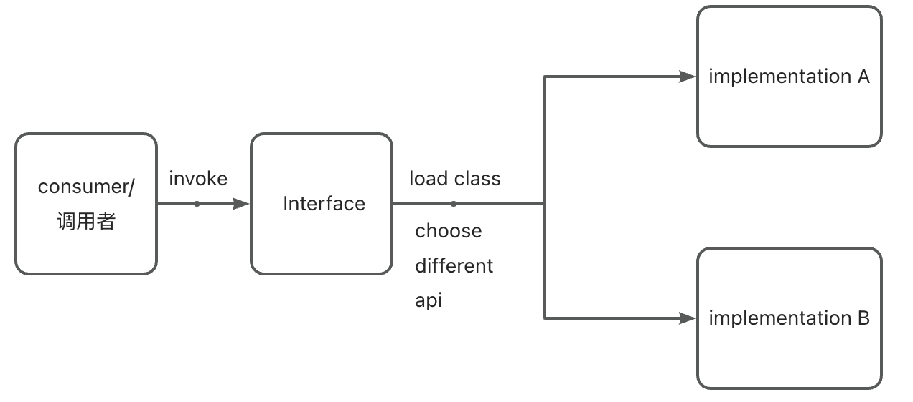
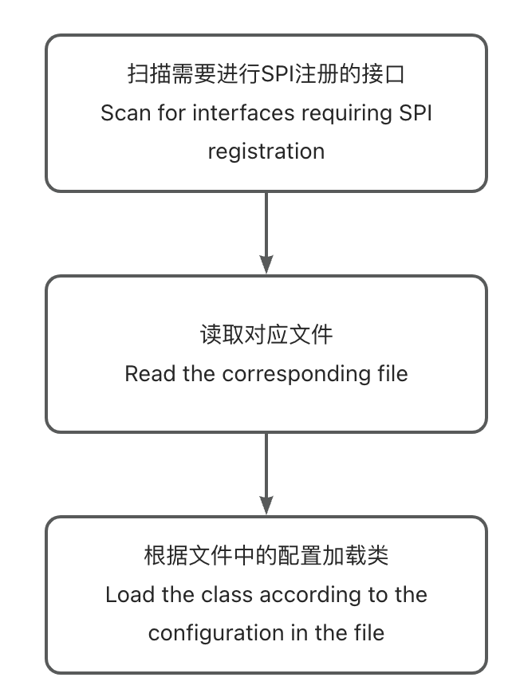
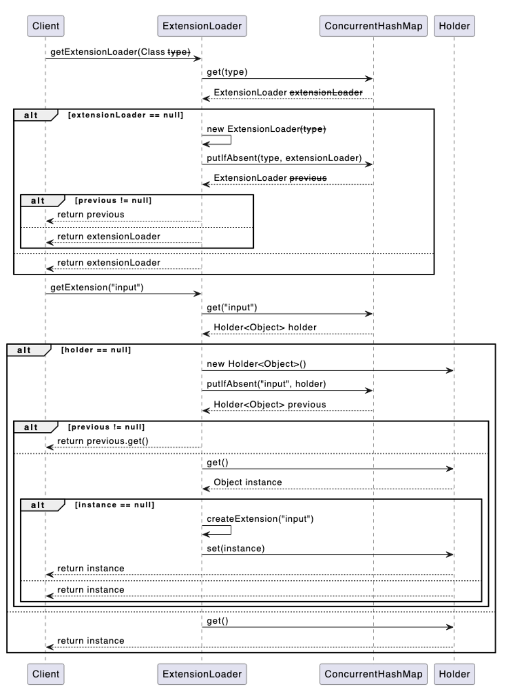

# java spi 应用

## Spi 定义

在Java中，SPI代表Service Provider Interface（服务提供者接口）。SPI是一种机制，允许应用程序通过在类路径中发现和加载可插拔的组件或服务提供者来扩展其功能。它提供了一种松耦合的方式，允许开发人员编写可以与多个实现进行交互的代码，而无需显式地引用特定的实现类。

## Api与Spi区别

API是用于定义软件组件之间的交互规则和约定，而SPI是一种机制，用于实现可插拔的组件或服务的扩展性。

API用于暴露功能和功能，供其他开发人员使用和集成，而SPI用于动态加载和使用可替换的组件实现。

API是面向开发人员的，提供了编程接口和文档，以便正确使用和集成软件组件。SPI是面向开发人员和框架/应用程序的，用于扩展框架或应用程序的功能。

API是被调用方定义的，它规定了调用方式和参数。SPI是调用方定义的，它允许被调用方提供实现。

## Spi机制



## 实现过程



## 在Rpc中的实现

​    在[简单的RPC框架实现](https://github.com/pjpjsocute/rpc-service)中基于Dubbo实现了一个基于注解的SPI机制，这里将简单介绍下原理。

### 实现：

#### 1

定义一个SPI注解，用于标注所有需要进行SPI注册的接口

```java
@Documented
@Retention(RetentionPolicy.RUNTIME)
@Target(ElementType.TYPE)
public @interface SPI {
}
```

其次，由于为了防止并发冲突问题，这里使用包装类对实例接口进行包装，用于保证多线程过程中的数据安全。

```java
public class Holder<T> {

    private volatile T value;

    public T get() {
        return value;
    }

    public void set(T value) {
        this.value = value;
    }
}
```

holder可以作为一个锁对象保证安全。

参考spring spi ,extension的配置文件定义为以下格式key = ‘full path’,如zk=org.example.ray.infrastructure.adapter.impl.RpcServiceFindingAdapterImpl

这样可以方便在系统内通过key创建获取和调用

#### 2

为了能够避免重复加载创建的问题，使用map作为缓存。同时为了提高获取的效率，针对不同服务的服务，会有不同的拓展实例，缓存不同服务下的实例。

```java
public final class ExtensionLoader<T> {
		//extention path
    private static final String                            SERVICE_DIRECTORY   = "META-INF/extension/";
  	//save extentionloader for load different class
    private static final Map<Class<?>, ExtensionLoader<?>> EXTENSION_LOADERS   = new ConcurrentHashMap<>();
  	//save all instance
    private static final Map<Class<?>, Object>             EXTENSION_INSTANCES = new ConcurrentHashMap<>();

    private final Class<?>                                 type;
  	//save different service hold instance
    private final Map<String, Holder<Object>>              cachedInstances     = new ConcurrentHashMap<>();
  	//save different instance
    private final Holder<Map<String, Class<?>>>            cachedClasses       = new Holder<>();
  
  private ExtensionLoader(Class<?> type) {
        this.type = type;
    }
}
```

#### 3

实现获取classloader和getExtension方法


