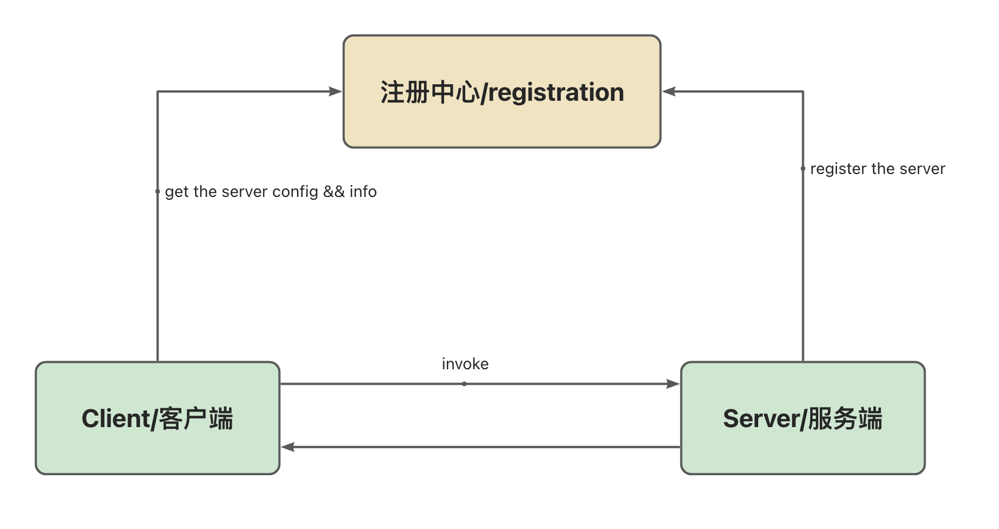
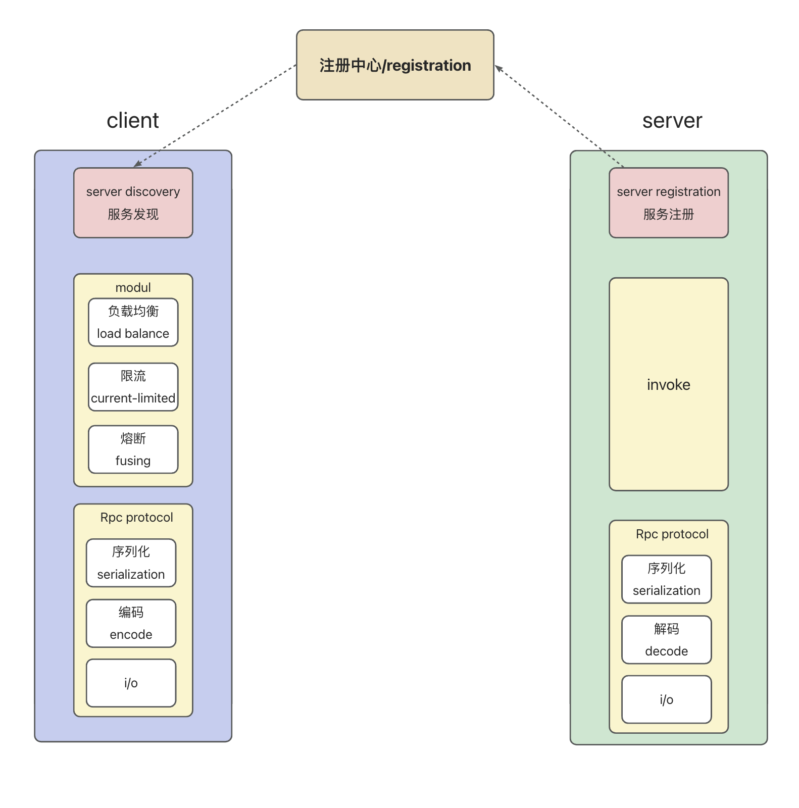

# 基于springBoot,手写一个简单的RPC框架(一)

---
 Code:pjpjsocute/rpc-service: personal rcp attempt (github.com)
 技术栈使用包括：springboot,Zookeeper,netty,java spi

---

## RPC定义

远程过程调用（Remote Procedure Call）是一种通信机制，允许不同的服务之间通过网络进行通信和交互。

通过RPC，一个服务可以向另一个服务发起请求并获取响应，就像本地调用一样，而无需开发者手动处理底层的网络通信细节。RPC框架会封装底层的网络传输，并提供了远程服务接口的定义、序列化和反序列化数据等功能。

### rpc与http辨析：

​    HTTP是一种用于传输超文本的应用层协议，它在客户端和服务器之间进行通信。它基于请求-响应模型，客户端发送HTTP请求到服务器，服务器处理请求并返回相应的HTTP响应。RPC更类似一种架构思想，RPC可以用HTTP实现，TCP实现。

## RPC流程

一个简单的RPC架构如图所示：



## 如何实现：

### 一个简单的RPC调用链路：



## 基于netty和ZK的服务端实现

根据上图，首先我们需要实现服务注册。

### 服务注册：

目前RPC框架大都支持注解的方式进行注册，这里也使用相同的方式。

#### 定义注册注解

```java
@Documented
@Retention(RetentionPolicy.RUNTIME)
@Target({ElementType.TYPE})
@Inherited
public @interface RpcProvider {

    /**
     * Service group, default value is empty string
     */
    String project() default "default";

    /**
     * Service version, default value is 1.0
     * 
     * @return
     */
    String version() default "1.0";

    /**
     * Service group, default value is empty string
     */
    String group() default "default";

}

@Documented
@Retention(RetentionPolicy.RUNTIME)
@Target({ElementType.FIELD, ElementType.TYPE})
@Inherited
public @interface RpcConsumer {
    /**
     * Service project, default value is empty string
     */
    String project() default "default";

    /**
     * Service version, default value is 1.0
     * 
     * @return
     */
    String version() default "1.0";

    /**
     * Service group, default value is empty string
     */
    String group() default "default";
}

@Target({ElementType.TYPE, ElementType.METHOD})
@Retention(RetentionPolicy.RUNTIME)
@Import(CustomBeanScannerRegistrar.class)
@Documented
public @interface SimpleRpcApplication {

    String[] basePackage();
}
```

​        该注解将定义服务版本，group(区分同名同项目的不同接口)，项目名，用于服务暴露。

​        同理，还需要一个注解用于消费;一个注解定义需要扫描的包

#### 在启动时注册服务

##### 首先，需要将带有@provider的注解注册

获取需要扫描的包，随后带有注解的bean进行注册进入spring即可

```java
public class CustomBeanScannerRegistrar implements ImportBeanDefinitionRegistrar, ResourceLoaderAware {

    private ResourceLoader resourceLoader;

    private static final String API_SCAN_PARAM = "basePackage";

    private static final String SPRING_BEAN_BASE_PACKAGE = "org.example.ray";

    @Override
    public void registerBeanDefinitions(AnnotationMetadata importingClassMetadata, BeanDefinitionRegistry registry) {
        //get the scan annotation and the bean package to be scanned
        String[] scanBasePackages = fetchScanBasePackage(importingClassMetadata);
        LogUtil.info("scanning packages: [{}]", (Object) scanBasePackages);
        
//        //scan the package and register the bean
//        RpcBeanScanner rpcConsumerBeanScanner = new RpcBeanScanner(registry, RpcConsumer.class);
        RpcBeanScanner rpcProviderBeanScanner = new RpcBeanScanner(registry, RpcProvider.class);
        RpcBeanScanner springBeanScanner = new RpcBeanScanner(registry, Component.class);
        if (resourceLoader != null) {
            springBeanScanner.setResourceLoader(resourceLoader);
            rpcProviderBeanScanner.setResourceLoader(resourceLoader);
        }
        int rpcServiceCount = rpcProviderBeanScanner.scan(scanBasePackages);
        LogUtil.info("rpcServiceScanner扫描的数量 [{}]", rpcServiceCount);
        LogUtil.info("scanning RpcConsumer annotated beans end");
    }

    @Override
    public void setResourceLoader(ResourceLoader resourceLoader) {
        this.resourceLoader = resourceLoader;
    }
    
    private String[] fetchScanBasePackage(AnnotationMetadata importingClassMetadata){
        AnnotationAttributes annotationAttributes = AnnotationAttributes.fromMap(importingClassMetadata.getAnnotationAttributes(SimpleRpcApplication.class.getName()));
        String[] scanBasePackages = new String[0];
        if (annotationAttributes != null) {
            scanBasePackages = annotationAttributes.getStringArray(API_SCAN_PARAM);
        }
        //user doesn't specify the package to scan,use the Application base package
        if (scanBasePackages.length == 0) {
            scanBasePackages = new String[]{((org.springframework.core.type.StandardAnnotationMetadata) importingClassMetadata).getIntrospectedClass().getPackage().getName()};
        }
        return scanBasePackages;
    }

}
```

##### 在bean初始化之前将服务和相关的配置进行注册，确保spring启动后服务已经注册成功

```java
@Component
public class RpcBeanPostProcessor implements BeanPostProcessor {

    private final RpcServiceRegistryAdapter adapter;

    private final RpcSendingServiceAdapter  sendingServiceAdapter;

    public RpcBeanPostProcessor() {
        this.adapter = SingletonFactory.getInstance(RpcServiceRegistryAdapterImpl.class);;
        this.sendingServiceAdapter = ExtensionLoader.getExtensionLoader(RpcSendingServiceAdapter.class)
            .getExtension(RpcRequestSendingEnum.NETTY.getName());
    }

    /**
     * register service
     *
     * @param bean
     * @param beanName
     * @return
     * @throws BeansException
     */
    @Override
    public Object postProcessBeforeInitialization(Object bean, String beanName) throws BeansException {
        LogUtil.info("start process register service: {}", bean);
        // register service
        if (bean.getClass().isAnnotationPresent(RpcProvider.class)) {
            RpcProvider annotation = bean.getClass().getAnnotation(RpcProvider.class);
            // build rpc service config
            RpcServiceConfig serviceConfig = RpcServiceConfig.builder()
                .service(bean)
                .project(annotation.project())
                .version(annotation.version())
                .group(annotation.group())
                .build();
            LogUtil.info("register service: {}", serviceConfig);
            adapter.registryService(serviceConfig);
        }
        return bean;
    }
}
```

##### 实现服务注册的具体方法

注册一个服务，至少应该吧包括:服务提供者(ip)，服务名，以及@RpcProvider 中的变量，所以，可以先定义一个RpcServiceConfig.

```java
@Data
@NoArgsConstructor
@AllArgsConstructor
@Builder
public class RpcServiceConfig {
    /**
     * service version
     */
    private String version = "";

    /**
     * target service
     */
    private Object service;

    /**
     * belong to which project
     */
    private String project = "";

    /**
     * group
     */
    private String group   = "";

    /**
     * generate service name,use to distinguish different service,and * can be split to get the service name
     * @return
     */
    public String fetchRpcServiceName() {
        return this.getProject() + "*" + this.getGroup() + "*" + this.getServiceName() + "*" + this.getVersion();
    }

    /**
     * get the interface name
     * 
     * @return
     */
    public String getServiceName() {
        return this.service.getClass().getInterfaces()[0].getCanonicalName();
    }

}
```

提供2个方法，注册服务与根据服务名得到对应的bean

```java
public interface RpcServiceRegistryAdapter {

    /**
     * @param rpcServiceConfig rpc service related attributes
     */
    void registryService(RpcServiceConfig rpcServiceConfig);

    /**
     * @param rpcClassName rpc class name
     * @return service object
     */
    Object getService(String rpcClassName);

}
```

注册流程可以分为3步，生成地址->服务注册进入Zookeeper->注册进入缓存。这里使用一个ConcurrentHashMap来进行缓存服务(方法中最后调用了zookeeper的api进行注册，因为与RPC关联不大，所以略过，可以直接参考源码)。

```java
public class RpcServiceRegistryAdapterImpl implements RpcServiceRegistryAdapter {

    /**
     * cache map
     */
    private final Map<String, Object> serviceMap = new ConcurrentHashMap<>();

    @Override
    public void registryService(RpcServiceConfig rpcServiceConfig) {
        try {
            // first get address and service
            String hostAddress = InetAddress.getLocalHost().getHostAddress();
            // add service to zk
            LogUtil.info("add service to zk,service name{},host:{}", rpcServiceConfig.fetchRpcServiceName(),hostAddress);
            registerServiceToZk(rpcServiceConfig.fetchRpcServiceName(),
                new InetSocketAddress(hostAddress, PropertiesFileUtil.readPortFromProperties()));
            // add service to map cache
            registerServiceToMap(rpcServiceConfig);
        } catch (UnknownHostException e) {
            LogUtil.error("occur exception when getHostAddress", e);
            throw new RuntimeException(e);
        }

    }

    @Override
    public Object getService(String rpcServiceName) {
        Object service = serviceMap.get(rpcServiceName);
        if (null == service) {
            throw new RpcException(RpcErrorMessageEnum.SERVICE_CAN_NOT_BE_FOUND.getCode(),"service not found");
        }
        return service;
    }

    private void registerServiceToZk(String rpcServiceName, InetSocketAddress inetSocketAddress) {
        String servicePath = CuratorClient.ZK_REGISTER_ROOT_PATH + "/" + rpcServiceName + inetSocketAddress.toString();
        CuratorFramework zkClient = CuratorClient.getZkClient();
        CuratorClient.createPersistentNode(zkClient, servicePath);
    }

    private void registerServiceToMap(RpcServiceConfig rpcServiceConfig) {
        String rpcServiceName = rpcServiceConfig.fetchRpcServiceName();
        if (serviceMap.containsKey(rpcServiceName)) {
            return;
        }
        serviceMap.put(rpcServiceName, rpcServiceConfig.getService());
    }
}
```

​    到这里，一个服务的注册流程已经完成。
