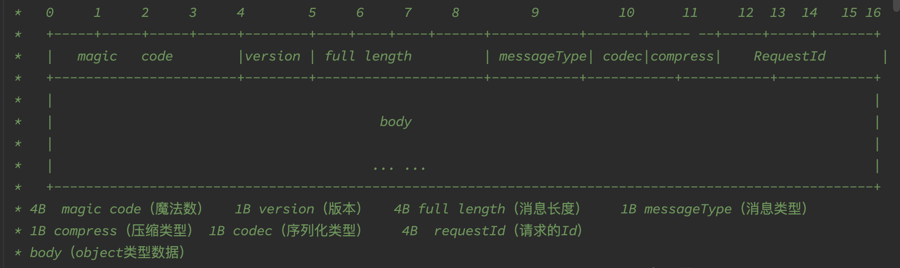

# 基于springBoot,手写一个简单的RPC框架(二)


继续上一章，实现了服务注册后需要实现服务调用。

### 服务执行

一个RPC的服务调用应该分为以下几步：

请求监听；

解码请求；

方法调用；

返回结果；

接下来将依次实现以上功能；

#### 请求监听

需要定义一个RpcRequest请求类，由于后续处理

```java
@Data
@AllArgsConstructor
@NoArgsConstructor
@Builder
public class RpcRequest implements Serializable {

    private static final long serialVersionUID = 8509587559718339795L;
    /**
     * traceId
     */
    private String traceId;
    /**
     * interface name
     */
    private String serviceName;
    /**
     * method name
     */
    private String methodName;
    /**
     * parameters
     */
    private Object[] parameters;
    /**
     * parameter types
     */
    private Class<?>[] paramTypes;
    /**
     * version
     */
    private String version;
    /**
     * group
     */
    private String project;

    private String group;

    /**
     * generate service name,use to distinguish different service,and * can be split to get the service name
     */
    public String fetchRpcServiceName() {
        return this.getProject() +"*"+this.getGroup()+"*"+ this.getServiceName() +"*"+ this.getVersion();
    }

}
```

监听请求需要启动一个netty server，用于监听请求service的服务。

启动时首先需要关闭之前注册的服务等资源。

随后对netty需要的资源进行依次初始化。

以下是一段netty的启动代码，其中需要加入编码和解码器用于协议解析，探活。

同时，需要加入限流和解码后的请求处理hanlder

```java
@Component
public class NettyServer {

    public NettyServer() {

    }

    public void start() {
        LogUtil.info("netty server init");

        ServerShutdownHook.getInstance().registerShutdownHook();

        EventLoopGroup listenerGroup = initListenerGroup();
        EventLoopGroup workerGroup = initWorkerGroup();
        DefaultEventExecutorGroup businessGroup = initBusinessGroup();

        LogUtil.info("netty server start");

        try {
            ServerBootstrap serverBootstrap = configureServerBootstrap(listenerGroup, workerGroup, businessGroup);
            bindAndListen(serverBootstrap);
        } catch (Exception e) {
            LogUtil.error("occur exception when start server:", e);
        } finally {
            shutdown(listenerGroup, workerGroup, businessGroup);
        }

    }

    private EventLoopGroup initListenerGroup() {
        return new NioEventLoopGroup(1);
    }

    private EventLoopGroup initWorkerGroup() {
        return new NioEventLoopGroup();
    }

    private DefaultEventExecutorGroup initBusinessGroup() {
        return new DefaultEventExecutorGroup(
                Runtime.getRuntime().availableProcessors() * 2,
                ThreadPoolFactoryUtil.createThreadFactory("netty-server-business-group", false)
        );
    }

    private ServerBootstrap configureServerBootstrap(EventLoopGroup listenerGroup, EventLoopGroup workerGroup, DefaultEventExecutorGroup businessGroup) {
        ServerBootstrap serverBootstrap = new ServerBootstrap();
        serverBootstrap.group(listenerGroup, workerGroup)
                .channel(NioServerSocketChannel.class)
                .childOption(ChannelOption.SO_KEEPALIVE, true)
                .childOption(ChannelOption.TCP_NODELAY, true)
                .option(ChannelOption.SO_BACKLOG, 128)
                .handler(new LoggingHandler(LogLevel.INFO))
                .childHandler(new ChannelInitializer<SocketChannel>() {
                    @Override
                    protected void initChannel(SocketChannel socketChannel) throws Exception {
                        ChannelPipeline pipeline = socketChannel.pipeline();
                        pipeline.addLast(new IdleStateHandler(30, 0, 0, TimeUnit.SECONDS));
                        pipeline.addLast(new RpcMessageEncoder());
                        pipeline.addLast(new RpcMessageDecoder());
                        pipeline.addLast(new DefaultTrafficBlockHandler());
                        pipeline.addLast(businessGroup, new NettyRpcServerHandler());
                    }
                });

        return serverBootstrap;
    }

    private void bindAndListen(ServerBootstrap serverBootstrap) throws UnknownHostException, InterruptedException {
        LogUtil.info("netty server bind port:{} " , PropertiesFileUtil.readPortFromProperties());
        String host = InetAddress.getLocalHost().getHostAddress();
        ChannelFuture f = serverBootstrap.bind(host, PropertiesFileUtil.readPortFromProperties()).sync();
        f.channel().closeFuture().sync();
    }

    private void shutdown(EventLoopGroup listenerGroup, EventLoopGroup workerGroup, DefaultEventExecutorGroup businessGroup) {
        listenerGroup.shutdownGracefully();
        workerGroup.shutdownGracefully();
        businessGroup.shutdownGracefully();
    }

}

@NoArgsConstructor(access = AccessLevel.PRIVATE)
public class ServerShutdownHook {

    private static final ServerShutdownHook INSTANCE = new ServerShutdownHook();

    public static ServerShutdownHook getInstance() {
        return INSTANCE;
    }

    /**
     * register shut down hook
     */
    public void registerShutdownHook() {
        Runtime.getRuntime().addShutdownHook(new Thread(() -> {
            // 执行清理操作
            clearAll();
        }));
    }

    private void clearAll() {
        try {
            // 清理注册表
            InetSocketAddress inetSocketAddress = new InetSocketAddress(InetAddress.getLocalHost().getHostAddress(), PropertiesFileUtil.readPortFromProperties());
            CuratorClient.clearRegistry(CuratorClient.getZkClient(), inetSocketAddress);
        } catch (Exception ignored) {

        }
        // 关闭线程池
        ThreadPoolFactoryUtil.shutDownAllThreadPool();
    }

}
```

结合ApplicationRunner，实现server的自动启动

```java
@Component
public class NettyServerRunner implements ApplicationRunner {

    @Autowired
    private NettyServer nettyServer;

    public NettyServerRunner() {}

    @Override
    public void run(ApplicationArguments args) throws Exception {
        nettyServer.start();
    }
}
```

#### 序列化

本项目默认只是实现了hessen的序列化和gzip加解压，这部分有许多的教程，所以在这里介绍。具体的代码可以在源码的org.example.ray.infrastructure.serialize包和org.example.ray.infrastructure.compress包中找到

#### 编码与协议

实现了服务后，我们需要依次为他补充编码和处理类。

在实现编码的服务之前，首先应该确定底层的编码协议。

##### 协议

本项目参考一些已有的协议设计，选择了一种比较简单的协议设计方式，如下图所示:



协议由一个16byte的header和body组成。

其中0-4是magic code，用于校验

4-5为自定义的协议版本

5-8是整个message的长度，用于解码

8-9定义了消息类型，包括请求，响应，心跳请求，心跳响应。

10为编码方式

11为压缩方式

12-16为一个整型，为请求的编号

Java pojo如下：

```java
@Data
@NoArgsConstructor
@AllArgsConstructor
@Builder
public class RpcData {
    /**
     * rpc message type
     */
    private byte   messageType;
    /**
     * serialization type
     */
    private byte   serializeMethodCodec;
    /**
     * compress type
     */
    private byte   compressType;
    /**
     * request id
     */
    private int    requestId;
    /**
     * request data
     */
    private Object data;

    public boolean isHeatBeatRequest() {
        return messageType == RpcConstants.HEARTBEAT_REQUEST_TYPE;
    }

    public boolean canSendRequest() {
        return messageType != RpcConstants.HEARTBEAT_REQUEST_TYPE
            && messageType != RpcConstants.HEARTBEAT_RESPONSE_TYPE;
    }

    public boolean isHeartBeatResponse() {
        return messageType == RpcConstants.HEARTBEAT_RESPONSE_TYPE;
    }

    public boolean isResponse() {
        return messageType == RpcConstants.RESPONSE_TYPE;
    }
}
```

在了解了协议之后，实现解码

##### 解码

LengthFieldBasedFrameDecoder解码器可以参考以下文章

```tex
https://zhuanlan.zhihu.com/p/95621344"
```

在了解LengthFieldBasedFrameDecoder解码器的基础上，解码的过程其实并不复杂。主要是解码header，校验，和解码body3部分，具体实现可以参考代码和注释。

解码部分使用java spi，可以定制选择反序列化和解压方法，此部分可以参考github中的代码，或者可以只使用固定序列化和解压方法替代spi部分。

本项目默认只是实现了hessen的序列化和gzip加解压，这部分有许多的教程，所以在这里介绍。具体的代码可以在源码的org.example.ray.infrastructure.serialize包和org.example.ray.infrastructure.compress包中找到

```java
public class RpcMessageDecoder extends LengthFieldBasedFrameDecoder {

    public RpcMessageDecoder() {
        // lengthFieldOffset: magic code is 4B, and version is 1B, and then full
        // length. so value is 5
        // lengthFieldLength: full length is 4B. so value is 4
        // lengthAdjustment: full length include all data and read 9 bytes
        // before, so the left length is (fullLength-9). so values is -9
        // initialBytesToStrip: we will check magic code and version manually,
        // so do not strip any bytes. so values is 0
        this(8 * 1024 * 1024, 5, 4, -9, 0);
    }

    public RpcMessageDecoder(int maxFrameLength, int lengthFieldOffset, int lengthFieldLength, int lengthAdjustment,
        int initialBytesToStrip) {
        super(maxFrameLength, lengthFieldOffset, lengthFieldLength, lengthAdjustment, initialBytesToStrip);
    }

    @Override
    protected Object decode(ChannelHandlerContext ctx, ByteBuf in) throws Exception {
        // get the bytebuf which contains the frame
        Object decode = super.decode(ctx, in);
        if (decode instanceof ByteBuf) {
            ByteBuf byteBuf = (ByteBuf)decode;
            // if data not empty, decode it
            if (byteBuf.readableBytes() >= RpcConstants.HEAD_LENGTH) {
                try {
                    return decode(byteBuf);
                } catch (Exception e) {
                    LogUtil.error("Decode error:{} ,input:{}", e, byteBuf);
                } finally {
                    byteBuf.release();
                }
            }
        }
        return decode;
    }

    /**
     * read byte array from byteBuf
     * 
     * @param byteBuf
     * @return
     */
    private Object decode(ByteBuf byteBuf) {
        LogUtil.info("start decode");
        checkMagicCode(byteBuf);
        checkVersion(byteBuf);

        int fullLength = byteBuf.readInt();
        RpcData rpcMessage = decodeRpcMessage(byteBuf);

        if (rpcMessage.isHeatBeatRequest()) {
            return handleHeatBeatRequest(rpcMessage);
        }

        if (rpcMessage.isHeartBeatResponse()) {
            return handleHeartBeatResponse(rpcMessage);
        }

        return handleNormalRequest(rpcMessage, byteBuf, fullLength);
    }

    private RpcData decodeRpcMessage(ByteBuf byteBuf) {
        LogUtil.info("start decode RpcMessage data");
        byte messageType = byteBuf.readByte();
        byte codec = byteBuf.readByte();
        byte compress = byteBuf.readByte();
        int traceId = byteBuf.readInt();

        return RpcData.builder()
                .serializeMethodCodec(codec)
                .traceId(traceId)
                .compressType(compress)
                .messageType(messageType)
                .build();
    }

    private RpcData handleHeatBeatRequest(RpcData rpcMessage) {
        rpcMessage.setData(RpcConstants.PING);
        return rpcMessage;
    }

    private RpcData handleHeartBeatResponse(RpcData rpcMessage) {
        rpcMessage.setData(RpcConstants.PONG);
        return rpcMessage;
    }

    private Object handleNormalRequest(RpcData rpcMessage, ByteBuf byteBuf, int fullLength) {
        int bodyLength = fullLength - RpcConstants.HEAD_LENGTH;
        if (bodyLength <= 0) {
            return rpcMessage;
        }
        return decodeBody(rpcMessage, byteBuf, bodyLength);
    }

    private RpcData decodeBody(RpcData rpcMessage, ByteBuf byteBuf, Integer bodyLength) {
        LogUtil.info("start decode body");
        byte[] bodyBytes = new byte[bodyLength];
        byteBuf.readBytes(bodyBytes);
        // decompose
        String compressName = CompressTypeEnum.getName(rpcMessage.getCompressType());
        CompressService extension =
            ExtensionLoader.getExtensionLoader(CompressService.class).getExtension(compressName);
        bodyBytes = extension.decompress(bodyBytes);
        // deserialize
        if (rpcMessage.getMessageType() == RpcConstants.REQUEST_TYPE) {
            RpcRequest rpcRequest = ExtensionLoader.getExtensionLoader(SerializationService.class)
                .getExtension(SerializationTypeEnum.getName(rpcMessage.getSerializeMethodCodec()))
                .deserialize(bodyBytes, RpcRequest.class);
            rpcMessage.setData(rpcRequest);
        } else {
            RpcResponse rpcResponse = ExtensionLoader.getExtensionLoader(SerializationService.class)
                .getExtension(SerializationTypeEnum.getName(rpcMessage.getSerializeMethodCodec()))
                .deserialize(bodyBytes, RpcResponse.class);
            rpcMessage.setData(rpcResponse);
        }
        return rpcMessage;

    }

    private void checkVersion(ByteBuf byteBuf) {
        byte version = byteBuf.readByte();
        if (version != RpcConstants.VERSION) {
            throw new IllegalArgumentException("version is not compatible: " + version);
        }
    }

    private void checkMagicCode(ByteBuf byteBuf) {
        int length = RpcConstants.MAGIC_NUMBER.length;
        byte[] magicNumber = new byte[length];
        byteBuf.readBytes(magicNumber);
        for (int i = 0; i < length; i++) {
            if (magicNumber[i] != RpcConstants.MAGIC_NUMBER[i]) {
                throw new IllegalArgumentException("Unknown magic code: " + new String(magicNumber));
            }
        }
    }
}
```

##### 编码

编码的过程相对简单，就是根据协议，依次将对应位的数据写入即可

```java
public class RpcMessageEncoder extends MessageToByteEncoder<RpcData> {

    private static final AtomicInteger ATOMIC_INTEGER = new AtomicInteger(0);

    @Override
    protected void encode(ChannelHandlerContext channelHandlerContext, RpcData rpcData, ByteBuf byteBuf) {
        try {
            //encode head,marked full length index
            int fullLengthIndex = encodeHead(rpcData,byteBuf);
            // encode body
            int fullLength = encodeBody(rpcData, byteBuf);
            // back fill full length
            encodeLength(fullLengthIndex,fullLength,byteBuf);
        } catch (Exception e) {
            LogUtil.error("Encode request error:{},data:{}", e, rpcData);
            throw new RpcException(RpcErrorMessageEnum.REQUEST_ENCODE_FAIL.getCode(),
                RpcErrorMessageEnum.REQUEST_ENCODE_FAIL.getMessage());
        }

    }
    private int encodeHead(RpcData rpcData,ByteBuf byteBuf){
        // write magic code and version 0-5
        byteBuf.writeBytes(RpcConstants.MAGIC_NUMBER);
        byteBuf.writeByte(RpcConstants.VERSION);
        // marked full length index.
        int fullLengthIndex = byteBuf.writerIndex();
        // write placeholder for full length 9+
        byteBuf.writerIndex(byteBuf.writerIndex() + 4);
        // write message type
        byteBuf.writeByte(rpcData.getMessageType());
        // write codec
        byteBuf.writeByte(rpcData.getSerializeMethodCodec());
        // write compress
        byteBuf.writeByte(rpcData.getCompressType());
        // write requestId
        byteBuf.writeInt(ATOMIC_INTEGER.getAndIncrement());
        return fullLengthIndex;
    }

    private int encodeBody(RpcData rpcData,ByteBuf byteBuf){
        byte[] bodyBytes = null;
        int fullLength = RpcConstants.HEAD_LENGTH;
        if (rpcData.canSendRequest()) {
            LogUtil.info("serialize request start");
            bodyBytes = ExtensionLoader.getExtensionLoader(SerializationService.class)
                    .getExtension(SerializationTypeEnum.getName(rpcData.getSerializeMethodCodec()))
                    .serialize(rpcData.getData());
            LogUtil.info("serialize request end");

            String compressName = CompressTypeEnum.getName(rpcData.getCompressType());
            CompressService extension =
                    ExtensionLoader.getExtensionLoader(CompressService.class).getExtension(compressName);
            bodyBytes = extension.compress(bodyBytes);
            fullLength += bodyBytes.length;
        }
        if (bodyBytes != null) {
            byteBuf.writeBytes(bodyBytes);
        }
        return fullLength;
    }

    private void encodeLength(int fullLengthIndex,int fullLength,ByteBuf byteBuf){
        int writeIndex = byteBuf.writerIndex();
        byteBuf.writerIndex(fullLengthIndex);
        byteBuf.writeInt(fullLength);
        byteBuf.writerIndex(writeIndex);
    }
}
```

#### 请求处理和调用

这里实用netty的SimpleChannelInboundHandler，可以避免资源释放的问题

由于前面已经实现了解码，所以只需要针对不同的请求类型进行不同的处理即可。

如果是心跳请求，则返回心跳响应

如果是服务请求，则通过动态代理调用服务，并写入结果返回给消费者。

定义一个响应类

```java
@AllArgsConstructor
@NoArgsConstructor
@Data
@Builder
public class RpcResponse<T> implements Serializable {

    private static final long serialVersionUID = 347966260947189201L;
    /**
     * request id
     */
    private String            requestId;
    /**
     * response code
     */
    private Integer           code;
    /**
     * response message
     */
    private String            message;
    /**
     * response body
     */
    private T                 data;

    /**
     * success
     * @param data
     * @param requestId
     * @return
     * @param <T>
     */
    public static <T> RpcResponse<T> success(T data, String requestId) {
        RpcResponse<T> response = new RpcResponse<>();
        response.setCode(RpcResponseCodeEnum.SUCCESS.getCode());
        response.setMessage(RpcResponseCodeEnum.SUCCESS.getMessage());
        response.setRequestId(requestId);
        if (null != data) {
            response.setData(data);
        }
        return response;
    }

    /**
     * fail
     * @return
     * @param <T>
     */
    public static <T> RpcResponse<T> fail() {
        RpcResponse<T> response = new RpcResponse<>();
        response.setCode(RpcResponseCodeEnum.FAIL.getCode());
        response.setMessage(RpcResponseCodeEnum.FAIL.getMessage());
        return response;
    }

}
```

serverhandler的核心方法为channelRead0

```java
public class NettyRpcServerHandler extends SimpleChannelInboundHandler<RpcData> {
    /**
     * Read the message transmitted by the server
     */

    private final RpcRequestHandler rpcRequestHandler;

    public NettyRpcServerHandler() {
        this.rpcRequestHandler = SingletonFactory.getInstance(RpcRequestHandler.class);
    }

    /**
     * heart beat handle
     * 
     * @param ctx
     * @param evt
     * @throws Exception
     */
    @Override
    public void userEventTriggered(ChannelHandlerContext ctx, Object evt) throws Exception {
        // if the channel is free，close it
        if (evt instanceof IdleStateEvent) {
            IdleState state = ((IdleStateEvent)evt).state();
            if (state == IdleState.READER_IDLE) {
                LogUtil.info("idle check happen, so close the connection");
                ctx.close();
            }
        } else {
            super.userEventTriggered(ctx, evt);
        }
    }

    /**
     * Called when an exception occurs in processing a client message
     */
    @Override
    public void exceptionCaught(ChannelHandlerContext ctx, Throwable cause) {
        LogUtil.error("server exceptionCaught");
        cause.printStackTrace();
        ctx.close();
    }

    @Override
    protected void channelRead0(ChannelHandlerContext ctx, RpcData rpcData) throws Exception {
        LogUtil.info("Server receive message: [{}]", rpcData);
        RpcData rpcMessage = new RpcData();
        setupRpcMessage(rpcMessage);

        if (rpcData.isHeatBeatRequest()) {
            handleHeartbeat(rpcMessage);
        } else {
            handleRpcRequest(ctx, rpcData, rpcMessage);
        }
        ctx.writeAndFlush(rpcMessage).addListener(ChannelFutureListener.CLOSE_ON_FAILURE);
    }

    private void setupRpcMessage(RpcData rpcMessage) {
        rpcMessage.setSerializeMethodCodec(SerializationTypeEnum.HESSIAN.getCode());
        rpcMessage.setCompressType(CompressTypeEnum.GZIP.getCode());
    }

    private void handleHeartbeat(RpcData rpcMessage) {
        rpcMessage.setMessageType(RpcConstants.HEARTBEAT_RESPONSE_TYPE);
        rpcMessage.setData(RpcConstants.PONG);
    }

    private void handleRpcRequest(ChannelHandlerContext ctx, RpcData rpcData, RpcData rpcMessage) throws Exception {
        RpcRequest rpcRequest = (RpcRequest)rpcData.getData();

        // invoke target method
        Object result = rpcRequestHandler.handle(rpcRequest);
        LogUtil.info("Server get result: {}", result);

        rpcMessage.setMessageType(RpcConstants.RESPONSE_TYPE);
        buildAndSetRpcResponse(ctx, rpcRequest, rpcMessage, result);
    }

    private void
        buildAndSetRpcResponse(ChannelHandlerContext ctx, RpcRequest rpcRequest, RpcData rpcMessage, Object result) {
        if (canBuildResponse(ctx)) {
            // If the channel is active and writable, a successful RPC response is constructed
            RpcResponse<Object> rpcResponse = RpcResponse.success(result, rpcRequest.getTraceId());
            rpcMessage.setData(rpcResponse);
        } else {
            // Construct a failed RPC response if the channel is not writable
            RpcResponse<Object> rpcResponse = RpcResponse.fail();
            rpcMessage.setData(rpcResponse);
            LogUtil.error("Not writable now, message dropped,message:{}", rpcRequest);
        }
    }

    private boolean canBuildResponse(ChannelHandlerContext ctx) {
        return ctx.channel().isActive() && ctx.channel().isWritable();
    }
}
```

tipp:  注册到zk后缓存的服务，可以直接基于动态代理进行调用

```java
public class RpcRequestHandler {

    private final RpcServiceRegistryAdapter adapter;

    public RpcRequestHandler() {
        this.adapter = SingletonFactory.getInstance(RpcServiceRegistryAdapterImpl.class);
    }

    /**
     * Processing rpcRequest: call the corresponding method, and then return the
     * method
     */
    public Object handle(RpcRequest request) {
        Object service = adapter.getService(request.fetchRpcServiceName());
        return invoke(request, service);
    }

    /**
     * get method execution results
     *
     * @param rpcRequest client request
     * @param service service object
     * @return the result of the target method execution
     */
    private Object invoke(RpcRequest rpcRequest, Object service) {
        Object result;
        try {
            Method method = service.getClass().getMethod(rpcRequest.getMethodName(), rpcRequest.getParamTypes());
            result = method.invoke(service, rpcRequest.getParameters());
            LogUtil.info("service:[{}] successful invoke method:[{}]", rpcRequest.getServiceName(),
                rpcRequest.getMethodName());
        } catch (NoSuchMethodException | IllegalArgumentException | InvocationTargetException
            | IllegalAccessException e) {
            LogUtil.error("occur exception when invoke target method,error:{},RpcRequest:{}", e, rpcRequest);
            throw new RpcException(RpcErrorMessageEnum.SERVICE_INVOCATION_FAILURE.getCode(), RpcErrorMessageEnum.SERVICE_INVOCATION_FAILURE.getMessage());
        }
        return result;
    }
}
```

至此，一个服务端的代码就完成了
