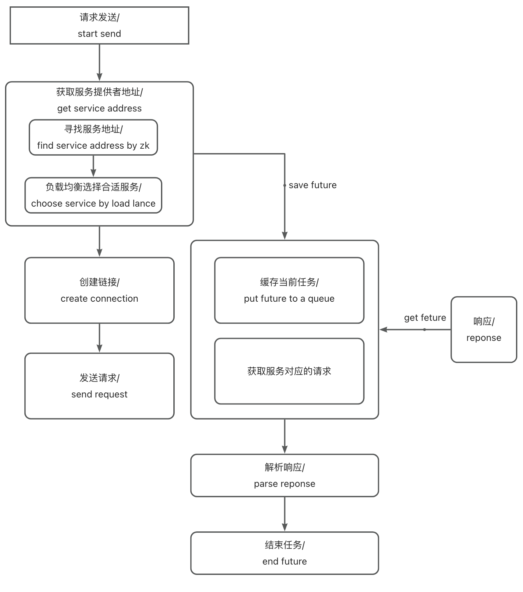

# 基于springBoot,手写一个简单的RPC框架(三)


继续上一章，在实现了服务端注册和调用之后，需要来实现客户端的功能，其中主要包括负载均衡，限流，请求发送和服务发现上。接下来将从一个RPC调用流程的顺序来实现接下来的功能

### 一次请求：

​            实现客户端之前，首先需要想清楚一次请求需要发送些什么。

​             首先，需要当前的服务名方法名，以及对应的参数和参数类型，否则服务端无法根据请求来进行对应的反射调用。

​            其次，请求中应该要带上@RpcConsumer内的参数，让服务端能够找到正确的服务。

​            最后，请求中应该带上本次请求的一个唯一值，以方便链路追踪。

​            至此，一个请求需要的基本参数已经完成。

```java
@Data
@AllArgsConstructor
@NoArgsConstructor
@Builder
public class RpcRequest implements Serializable {

    private static final long serialVersionUID = 8509587559718339795L;
    /**
     * traceId
     */
    private String            traceId;
    /**
     * interface name
     */
    private String            serviceName;
    /**
     * method name
     */
    private String            methodName;
    /**
     * parameters
     */
    private Object[]          parameters;
    /**
     * parameter types
     */
    private Class<?>[]        paramTypes;
    /**
     * version
     */
    private String            version;
    /**
     * group
     */
    private String            project;

    private String            group;

    /**
     * generate service name,use to distinguish different service,and * can be
     * split to get the service name
     */
    public String fetchRpcServiceName() {
        return this.getProject() + "*" + this.getGroup() + "*" + this.getServiceName() + "*" + this.getVersion();
    }

}
```

### 服务代理

​        第一步，在spring启动的过程中，扫描所有带有@RpcConsumer 为其生成代理，后续调用到该类方法的时候都会调用代理的方法，发起请求。

```java
@Component
public class RpcBeanPostProcessor implements BeanPostProcessor {

    private final RpcServiceRegistryAdapter adapter;

    private final RpcSendingServiceAdapter  sendingServiceAdapter;

    public RpcBeanPostProcessor() {
        this.adapter = SingletonFactory.getInstance(RpcServiceRegistryAdapterImpl.class);;
        this.sendingServiceAdapter = ExtensionLoader.getExtensionLoader(RpcSendingServiceAdapter.class)
            .getExtension(RpcRequestSendingEnum.NETTY.getName());
    }

    /**
     * register service
     *
     * @param bean
     * @param beanName
     * @return
     * @throws BeansException
     */
    @Override
    public Object postProcessBeforeInitialization(Object bean, String beanName) throws BeansException {
        LogUtil.info("start process register service: {}", bean);
        // register service
        if (bean.getClass().isAnnotationPresent(RpcProvider.class)) {
            RpcProvider annotation = bean.getClass().getAnnotation(RpcProvider.class);
            // build rpc service config
            RpcServiceConfig serviceConfig = RpcServiceConfig.builder()
                .service(bean)
                .project(annotation.project())
                .version(annotation.version())
                .group(annotation.group())
                .build();
            LogUtil.info("register service: {}", serviceConfig);
            adapter.registryService(serviceConfig);
        }
        return bean;
    }

    /**
     * proxy and injection of consumers
     *
     * @param bean
     * @param beanName
     * @return
     * @throws BeansException
     */
    @Override
    public Object postProcessAfterInitialization(Object bean, String beanName) throws BeansException {
        Class<?> toBeProcessedBean = bean.getClass();
        Field[] declaredFields = toBeProcessedBean.getDeclaredFields();
        for (Field declaredField : declaredFields) {
            if (declaredField.isAnnotationPresent(RpcConsumer.class)) {
                RpcConsumer annotation = declaredField.getAnnotation(RpcConsumer.class);
                // build rpc service config
                RpcServiceConfig serviceConfig = RpcServiceConfig.builder()
                    .project(annotation.project())
                    .version(annotation.version())
                    .group(annotation.group())
                    .build();
                // create the proxy bean Factory and the proxy bean
                RpcServiceProxy proxy = new RpcServiceProxy(sendingServiceAdapter, serviceConfig);
                Object rpcProxy = proxy.getProxy(declaredField.getType());
                declaredField.setAccessible(true);
                try {
                    LogUtil.info("create service proxy: {}", bean);
                    declaredField.set(bean, rpcProxy);
                } catch (IllegalAccessException e) {
                    e.printStackTrace();
                }
            }
        }
        return bean;
    }
}
```

接下来就是在代理类的invoke方法中实现对request的拼装和调用。同时获取Future中的响应值返回给调用者。

```java
public class RpcServiceProxy implements InvocationHandler {

    private final RpcSendingServiceAdapter sendingServiceAdapter;

    private final RpcServiceConfig         config;

    public RpcServiceProxy(RpcSendingServiceAdapter sendingServiceAdapter, RpcServiceConfig config) {
        this.sendingServiceAdapter = sendingServiceAdapter;
        this.config = config;
    }

    @Override
    public Object invoke(Object proxy, Method method, Object[] args) {
        LogUtil.info("invoked method: [{}]", method.getName());
        RpcRequest rpcRequest = buildRequest(method,args);

        RpcResponse<Object> rpcResponse = null;
        CompletableFuture<RpcResponse<Object>> completableFuture =
            (CompletableFuture<RpcResponse<Object>>)sendingServiceAdapter.sendRpcRequest(rpcRequest);
        try {
            rpcResponse = completableFuture.get();
            return rpcResponse.getData();
        } catch (Exception e) {
            LogUtil.error("occur exception:", e);
        }
        return null;
    }

    /**
     * get the proxy object
     */
    @SuppressWarnings("unchecked")
    public <T> T getProxy(Class<T> clazz) {
        return (T)Proxy.newProxyInstance(clazz.getClassLoader(), new Class<?>[] {clazz}, this);
    }

     private RpcRequest buildRequest(Method method,Object[] args){
         RpcRequest rpcRequest = RpcRequest.builder()
                 .methodName(method.getName())
                 .parameters(args)
                 .serviceName(method.getDeclaringClass().getName())
                 .paramTypes(method.getParameterTypes())
                 .traceId(UUID.randomUUID().toString())
                 .project(config.getProject())
                 .version(config.getVersion())
                 .group(config.getGroup())
                 .build();
        return rpcRequest;
     }
}
```

### 发送请求：

​        客户端的核心方法为发送请求，请求的发送有多种方法，这里仅基于netty的Nio进行了实现。以下是一个完整的时序。



​        首先实现发送方法，里面应该包含寻找地址，发送请求的功能。

```java
public class RpcSendingServiceAdapterImpl implements RpcSendingServiceAdapter {

    /**
     * EventLoopGroup is a multithreaded event loop that handles I/O operation.
     */
    private final EventLoopGroup             eventLoopGroup;

    /**
     * Bootstrap helt setting and start netty client
     */
    private final Bootstrap                  bootstrap;

    /**
     * Service discovery
     */
    private final RpcServiceFindingAdapter   findingAdapter;

    /**
     * Channel manager,mapping channel and address
     */
    private final AddressChannelManager      addressChannelManager;

    /**
     * Waiting process request queue
     */
    private final WaitingProcessRequestQueue waitingProcessRequestQueue;

    public RpcSendingServiceAdapterImpl() {
        this.findingAdapter = ExtensionLoader.getExtensionLoader(RpcServiceFindingAdapter.class)
            .getExtension(ServiceDiscoveryEnum.ZK.getName());
        this.addressChannelManager = SingletonFactory.getInstance(AddressChannelManager.class);
        this.waitingProcessRequestQueue = SingletonFactory.getInstance(WaitingProcessRequestQueue.class);
        // initialize
        eventLoopGroup = new NioEventLoopGroup();
        bootstrap = new Bootstrap();
        bootstrap.group(eventLoopGroup)
            .channel(NioSocketChannel.class)
            .handler(new LoggingHandler(LogLevel.INFO))
            // The timeout period for the connection.
            // If this time is exceeded or if the connection cannot be
            // established, the connection fails.
            .option(ChannelOption.CONNECT_TIMEOUT_MILLIS, 5000)
            .handler(new ChannelInitializer<SocketChannel>() {
                @Override
                protected void initChannel(SocketChannel ch) {
                    ChannelPipeline p = ch.pipeline();
                    // If no data is sent to the server within 15 seconds, a
                    // heartbeat request is sent
                    p.addLast(new IdleStateHandler(0, 5, 0, TimeUnit.SECONDS));
                    p.addLast(new RpcMessageEncoder());
                    p.addLast(new RpcMessageDecoder());
                    p.addLast(new NettyRpcClientHandler());
                }
            });
    }

    @Override
    public Object sendRpcRequest(RpcRequest rpcRequest) {
        CompletableFuture<RpcResponse<Object>> result = new CompletableFuture<>();
        InetSocketAddress address = findServiceAddress(rpcRequest);
        Channel channel = fetchAndConnectChannel(address);
        if (channel.isActive()) {
            addToProcessQueue(rpcRequest.getTraceId(), result);
            RpcData rpcData = prepareRpcData(rpcRequest);
            sendRpcData(channel, rpcData, result);
        } else {
            log.error("Send request[{}] failed", rpcRequest);
            throw new IllegalStateException();
        }
        return result;
    }
    private InetSocketAddress findServiceAddress(RpcRequest rpcRequest) {
        return findingAdapter.findServiceAddress(rpcRequest);
    }

    private void addToProcessQueue(String traceId, CompletableFuture<RpcResponse<Object>> result) {
        waitingProcessRequestQueue.put(traceId, result);
    }

    private RpcData prepareRpcData(RpcRequest rpcRequest) {
        return RpcData.builder()
                .data(rpcRequest)
                .serializeMethodCodec(SerializationTypeEnum.HESSIAN.getCode())
                .compressType(CompressTypeEnum.GZIP.getCode())
                .messageType(RpcConstants.REQUEST_TYPE)
                .build();
    }
    private void sendRpcData(Channel channel, RpcData rpcData, CompletableFuture<RpcResponse<Object>> result) {
        channel.writeAndFlush(rpcData).addListener((ChannelFutureListener)future -> {
            if (future.isSuccess()) {
                LogUtil.info("client send message: [{}]", rpcData);
            } else {
                future.channel().close();
                result.completeExceptionally(future.cause());
                LogUtil.error("Send failed:", future.cause());
            }
        });
    }

    private Channel fetchAndConnectChannel(InetSocketAddress address) {
        Channel channel = addressChannelManager.get(address);
        if (channel == null) {
            // connect to service to get new address and rebuild the channel
            channel = connect(address);
            addressChannelManager.set(address, channel);
        }
        return channel;
    }

    private Channel connect(InetSocketAddress address) {
        CompletableFuture<Channel> completableFuture = new CompletableFuture<>();
        bootstrap.connect(address).addListener((ChannelFutureListener)future -> {
            if (future.isSuccess()) {
                // set channel to future
                LogUtil.info("The client has connected [{}] successful!", address.toString());
                completableFuture.complete(future.channel());
            } else {
                LogUtil.error("The client failed to connect to the server [{}],future", address.toString(), future);
                throw new IllegalStateException();
            }
        });
        Channel channel = null;
        try {
            channel = completableFuture.get();
        } catch (Exception e) {
            LogUtil.error("occur exception when connect to server:", e);
        }
        return channel;
    }

    public Channel getChannel(InetSocketAddress inetSocketAddress) {
        Channel channel = addressChannelManager.get(inetSocketAddress);
        if (channel == null) {
            channel = connect(inetSocketAddress);
            addressChannelManager.set(inetSocketAddress, channel);
        }
        return channel;
    }
}
```

​        在这个类中，核心的方法是sendRpcRequest,他负责获取服务，创建链接，创建一个Future任务，并且发送请求。

#### 发现服务

发现服务的流程可以包括：

1.从注册中心中拉取服务地址列表

2.通过负载均衡算法获取服务具体类型。

##### 获取地址

下面先实现第一步（此处可以使用缓存进行进一步的优化，本项目中的zk使用了一个ConcurrentHashMap来代替缓存，详细代码可以见CuratorClient）：

```java
public class RpcServiceFindingAdapterImpl implements RpcServiceFindingAdapter {

    private final LoadBalanceService loadBalanceService;

    public RpcServiceFindingAdapterImpl() {
        this.loadBalanceService = ExtensionLoader.getExtensionLoader(LoadBalanceService.class).getExtension(LOAD_BALANCE);
    }

    @Override
    public InetSocketAddress findServiceAddress(RpcRequest rpcRequest) {
        String serviceName = rpcRequest.fetchRpcServiceName();
        CuratorFramework zkClient = CuratorClient.getZkClient();
        List<String> serviceAddresseList = CuratorClient.getChildrenNodes(zkClient, serviceName);
        if (CollectionUtils.isEmpty(serviceAddresseList)) {
            throw new RuntimeException("no service available, serviceName: " + serviceName);
        }

        String service = loadBalanceService.selectServiceAddress(serviceAddresseList, rpcRequest);
        if (StringUtils.isBlank(service)) {
            throw new RuntimeException("no service available, serviceName: " + serviceName);
        }
        String[] socketAddressArray = service.split(":");
        String host = socketAddressArray[0];
        int port = Integer.parseInt(socketAddressArray[1]);
        return new InetSocketAddress(host, port);
    }
}
```

##### 负载均衡——一致性哈希算法

###### 定义：

一致性哈希算法是一种用于分布式系统中数据分片和负载均衡的算法。它通过引入虚拟节点和哈希环的概念，实现了节点的动态扩缩容时最小化数据迁移的需求，提高了系统的稳定性和性能。它在分布式缓存、负载均衡等场景中被广泛应用。

###### 实现：

哈希值计算

首先，根据一致性哈希算法我们需要有根据对应的服务生成哈希值。在以下实现中，首先将输入通过SHA-256算法产生一个32字节（256位）的哈希值

但是这样的哈希值过长，并不方便处理，所以我们需要将他进行缩短。同时，一个节点映射多个哈希可以提高一致性哈希算法的分布均匀性，因为每个节点都会在哈希空间中拥有多个哈希值，这可以帮助减少因节点增加或减少而导致的哈希空间重分布的影响。

calculateHash 会对已经得到的256为哈希值从起点j开始向后取8字节生成一个新的Long类型的哈希值。

```java
protected static byte[] md5Hash(String input) {
    MessageDigest messageDigest = null;
    try {
        messageDigest = MessageDigest.getInstance("SHA-256");
        byte[] hashBytes = messageDigest.digest(input.getBytes(StandardCharsets.UTF_8));
        messageDigest.update(hashBytes);
        return messageDigest.digest();
    } catch (NoSuchAlgorithmException e) {
        LogUtil.error("No such algorithm exception: {}", e.getMessage());
        throw new RuntimeException(e);
    }

}

protected static Long calculateHash(byte[] digest, int idx) {
    if (digest.length < (idx + 1) * 8) {
        throw new IllegalArgumentException("Insufficient length of digest");
    }

    long hash = 0;
    // 8 bytes digest,a byte is 8 bits like :1321 2432
    // each loop choose a byte to calculate hash,and shift i*8 bits
    for (int i = 0; i < 8; i++) {
        hash |= (255L & (long)digest[i + idx * 8]) << (8 * i);
    }
    return hash;
}
```

实现一个虚拟节点选择器。

根据一致性哈希算法的定义，一个虚拟节点选择器需要将服务生成多个虚拟节点，并且将每个节点映射为多个哈希值，最后根据传入的哈希值获取最近的节点返回给调用者。

```java
private static class ConsistentHashLoadBalanceSelector {
        // hash to virtual node list
        private final TreeMap<Long, String> virtualInvokers;

        private ConsistentHashLoadBalanceSelector(List<String> serviceUrlList, int virtualNodeNumber) {
            this.virtualInvokers = new TreeMap<>();
            // generate service address virtual node]
            // one address may map to multiple virtual nodes
            // use the md5 hash algorithm to generate the hash value of the
            // virtual node
            LogUtil.info("init add serviceUrlList:{}", serviceUrlList);
            for (String serviceNode : serviceUrlList) {
                addVirtualNode(serviceNode, virtualNodeNumber);
            }

        }

        private void addVirtualNode(String serviceNode, int virtualNodeNumber) {
            for (int i = 0; i < virtualNodeNumber / 8; i++) {
                String virtualNodeName = serviceNode + "#" + i;
                byte[] md5Hash = md5Hash(virtualNodeName);
                // md5Hash have 32 bytes
                // use 8 byte for each virtual node
                for (int j = 0; j < 4; j++) {
                    Long hash = calculateHash(md5Hash, j);
                    virtualInvokers.put(hash, serviceNode);
                }
            }
        }

        public String select(String rpcServiceKey) {
            byte[] digest = md5Hash(rpcServiceKey);
            // use first 8 byte to get hash
            return selectForKey(calculateHash(digest, 0));
        }

        public String selectForKey(long hashCode) {
            Map.Entry<Long, String> entry = virtualInvokers.tailMap(hashCode, true).firstEntry();

            if (entry == null) {
                entry = virtualInvokers.firstEntry();
            }

            return entry.getValue();
        }

    }
```

实现完整负载均衡方法

将接口名和可用服务列表的哈希作为key，缓存对应的一致性哈希选择器，如果存在则直接从已有的哈希选择器中获得一个负载节点，如果不存在，则新建一个。

```java
public class ConsistentHashLoadBalanceService implements LoadBalanceService {

    private final Map<String, ConsistentHashLoadBalanceSelector> serviceToSelectorMap = new ConcurrentHashMap<>();

    private static class ConsistentHashLoadBalanceSelector {
        // hash to virtual node list
        private final TreeMap<Long, String> virtualInvokers;

        private ConsistentHashLoadBalanceSelector(List<String> serviceUrlList, int virtualNodeNumber) {
            this.virtualInvokers = new TreeMap<>();
            // generate service address virtual node]
            // one address may map to multiple virtual nodes
            // use the md5 hash algorithm to generate the hash value of the
            // virtual node
            LogUtil.info("init add serviceUrlList:{}", serviceUrlList);
            for (String serviceNode : serviceUrlList) {
                addVirtualNode(serviceNode, virtualNodeNumber);
            }

        }

        private void addVirtualNode(String serviceNode, int virtualNodeNumber) {
            for (int i = 0; i < virtualNodeNumber / 8; i++) {
                String virtualNodeName = serviceNode + "#" + i;
                byte[] md5Hash = md5Hash(virtualNodeName);
                // md5Hash have 32 bytes
                // use 8 byte for each virtual node
                for (int j = 0; j < 4; j++) {
                    Long hash = calculateHash(md5Hash, j);
                    virtualInvokers.put(hash, serviceNode);
                }
            }
        }

        public String select(String rpcServiceKey) {
            byte[] digest = md5Hash(rpcServiceKey);
            // use first 8 byte to get hash
            return selectForKey(calculateHash(digest, 0));
        }

        public String selectForKey(long hashCode) {
            Map.Entry<Long, String> entry = virtualInvokers.tailMap(hashCode, true).firstEntry();

            if (entry == null) {
                entry = virtualInvokers.firstEntry();
            }

            return entry.getValue();
        }

    }

    protected static byte[] md5Hash(String input) {
        MessageDigest messageDigest = null;
        try {
            messageDigest = MessageDigest.getInstance("SHA-256");
            byte[] hashBytes = messageDigest.digest(input.getBytes(StandardCharsets.UTF_8));
            messageDigest.update(hashBytes);
            return messageDigest.digest();
        } catch (NoSuchAlgorithmException e) {
            LogUtil.error("No such algorithm exception: {}", e.getMessage());
            throw new RuntimeException(e);
        }

    }

    protected static Long calculateHash(byte[] digest, int idx) {
        if (digest.length < (idx + 1) * 8) {
            throw new IllegalArgumentException("Insufficient length of digest");
        }

        long hash = 0;
        // 8 bytes digest,a byte is 8 bits like :1321 2432
        // each loop choose a byte to calculate hash,and shift i*8 bits
        for (int i = 0; i < 8; i++) {
            hash |= (255L & (long)digest[i + idx * 8]) << (8 * i);
        }
        return hash;
    }

    /**
     * Choose one from the list of existing service addresses list
     * 
     * @param serviceUrlList Service address list
     * @param rpcRequest
     * @return
     */
    @Override
    public String selectServiceAddress(List<String> serviceUrlList, RpcRequest rpcRequest) {
        int serviceListHash = System.identityHashCode(serviceUrlList);
        String interfaceName = rpcRequest.getServiceName();
        String selectorKey = interfaceName + serviceListHash;

        ConsistentHashLoadBalanceSelector consistentHashLoadBalanceSelector = serviceToSelectorMap
            .computeIfAbsent(selectorKey, key -> new ConsistentHashLoadBalanceSelector(serviceUrlList, VIRTUAL_NODES));

        return consistentHashLoadBalanceSelector.select(interfaceName + Arrays.stream(rpcRequest.getParameters()));
    }

}
```

#### 发送请求

##### 发送请求

```java
  @Override
  public Object sendRpcRequest(RpcRequest rpcRequest) {
      CompletableFuture<RpcResponse<Object>> result = new CompletableFuture<>();
      InetSocketAddress address = findServiceAddress(rpcRequest);
      Channel channel = fetchAndConnectChannel(address);
      if (channel.isActive()) {
          addToProcessQueue(rpcRequest.getTraceId(), result);
          RpcData rpcData = prepareRpcData(rpcRequest);
          sendRpcData(channel, rpcData, result);
      } else {
          log.error("Send request[{}] failed", rpcRequest);
          throw new IllegalStateException();
      }
      return result;
  }

  private void addToProcessQueue(String traceId, CompletableFuture<RpcResponse<Object>> result) {
          waitingProcessRequestQueue.put(traceId, result);
      }

private RpcData prepareRpcData(RpcRequest rpcRequest) {
      return RpcData.builder()
              .data(rpcRequest)
              .serializeMethodCodec(SerializationTypeEnum.HESSIAN.getCode())
              .compressType(CompressTypeEnum.GZIP.getCode())
              .messageType(RpcConstants.REQUEST_TYPE)
              .build();
  }
  private void sendRpcData(Channel channel, RpcData rpcData, CompletableFuture<RpcResponse<Object>> result) {
      channel.writeAndFlush(rpcData).addListener((ChannelFutureListener)future -> {
          if (future.isSuccess()) {
              LogUtil.info("client send message: [{}]", rpcData);
          } else {
              future.channel().close();
              result.completeExceptionally(future.cause());
              LogUtil.error("Send failed:", future.cause());
          }
      });
  }
```

##### 使用channel链接服务器

```java
private Channel fetchAndConnectChannel(InetSocketAddress address) {
    Channel channel = addressChannelManager.get(address);
    if (channel == null) {
        // connect to service to get new address and rebuild the channel
        channel = connect(address);
        addressChannelManager.set(address, channel);
    }
    return channel;
}

private Channel connect(InetSocketAddress address) {
    CompletableFuture<Channel> completableFuture = new CompletableFuture<>();
    bootstrap.connect(address).addListener((ChannelFutureListener)future -> {
        if (future.isSuccess()) {
            // set channel to future
            LogUtil.info("The client has connected [{}] successful!", address.toString());
            completableFuture.complete(future.channel());
        } else {
            LogUtil.error("The client failed to connect to the server [{}],future", address.toString(), future);
            throw new IllegalStateException();
        }
    });
    Channel channel = null;
    try {
        channel = completableFuture.get();
    } catch (Exception e) {
        LogUtil.error("occur exception when connect to server:", e);
    }
    return channel;
}
```

### Consumer进行返回值处理

```java
public class NettyRpcClientHandler extends SimpleChannelInboundHandler<RpcData> {

    private final RpcSendingServiceAdapterImpl adapter;

    private final WaitingProcessRequestQueue   waitingProcessRequestQueue;

    public NettyRpcClientHandler() {
        this.adapter = SingletonFactory.getInstance(RpcSendingServiceAdapterImpl.class);
        this.waitingProcessRequestQueue = SingletonFactory.getInstance(WaitingProcessRequestQueue.class);
    }

    /**
     * heart beat handle
     * 
     * @param ctx
     * @param evt
     * @throws Exception
     */
    @Override
    public void userEventTriggered(ChannelHandlerContext ctx, Object evt) throws Exception {
        // if the channel is free，close it
        if (evt instanceof IdleStateEvent) {
            IdleState state = ((IdleStateEvent)evt).state();
            if (state == IdleState.WRITER_IDLE) {
                LogUtil.info("write idle happen [{}]", ctx.channel().remoteAddress());
                Channel channel = adapter.getChannel((InetSocketAddress)ctx.channel().remoteAddress());
                RpcData rpcData = new RpcData();
                rpcData.setSerializeMethodCodec(SerializationTypeEnum.HESSIAN.getCode());
                rpcData.setCompressType(CompressTypeEnum.GZIP.getCode());
                rpcData.setMessageType(RpcConstants.HEARTBEAT_REQUEST_TYPE);
                rpcData.setData(RpcConstants.PING);
                channel.writeAndFlush(rpcData).addListener(ChannelFutureListener.CLOSE_ON_FAILURE);
            }
        } else {
            super.userEventTriggered(ctx, evt);
        }
    }

    /**
     * Called when an exception occurs in processing a client message
     */
    @Override
    public void exceptionCaught(ChannelHandlerContext ctx, Throwable cause) {
        LogUtil.error("server exceptionCaught");
        cause.printStackTrace();
        ctx.close();
    }

    @Override
    protected void channelRead0(ChannelHandlerContext ctx, RpcData rpcData) throws Exception {
        LogUtil.info("Client receive message: [{}]", rpcData);
        RpcData rpcMessage = new RpcData();
        setupRpcMessage(rpcMessage);

        if (rpcData.isHeartBeatResponse()) {
            LogUtil.info("heart [{}]", rpcMessage.getData());
        } else if (rpcData.isResponse()) {
            RpcResponse<Object> rpcResponse = (RpcResponse<Object>)rpcData.getData();
            waitingProcessRequestQueue.complete(rpcResponse);
        }
    }

    private void setupRpcMessage(RpcData rpcMessage) {
        rpcMessage.setSerializeMethodCodec(SerializationTypeEnum.HESSIAN.getCode());
        rpcMessage.setCompressType(CompressTypeEnum.GZIP.getCode());
    }

}
```
