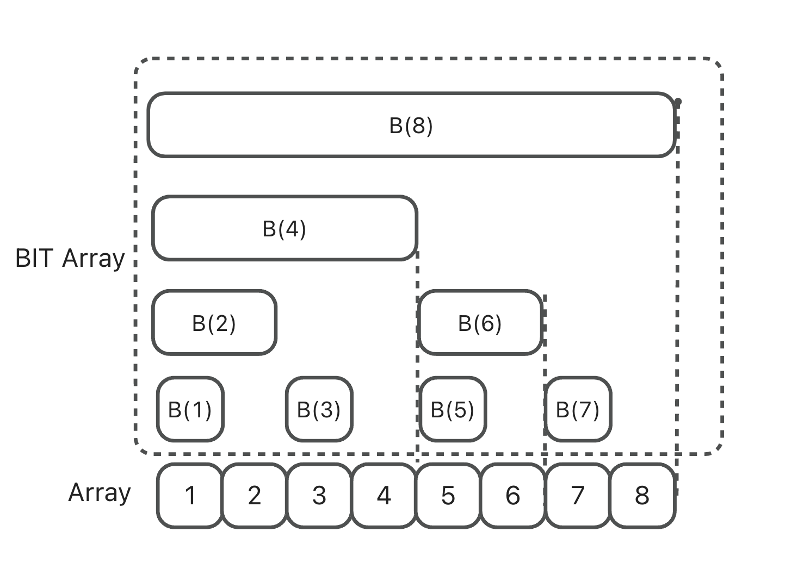

## 树状数组与力扣中的应用

### 为什么会需要树状数组

#### 思考以下问题

**QA**:  
假设存在一个整数序列 input，例如 `intput = [1,2,7,4,3]`，要求前 K 个数的和。

**Solution**:  
一般我们会求一个前缀和数组 `preSumArray`，其中 `preSumArray[i]` 代表前 `i` 个数的和。  
这样我们求前 N 个数的和只需要返回 `preSumArray[N]`，时间复杂度为 O(1)。如果需要查询 K 次，则复杂度为 O(K)。

#### 升级这个问题

**QA**:  
假设存在一个整数序列 input，例如 `intput = [1,2,7,4,3]`，现在在我们获取前 N 个数的和时，可能会先将 `i` 位置的数增加/减少 `value`。

**Solution**:  
一般我们会求一个前缀和数组 `preSumArray`，其中 `preSumArray[i]` 代表前 `i` 个数的和。  
但是如果我们需要在第 `i` 位置插入一个数 `x`，在进行更新时需要更新 `i` 之后的所有 `preSumArray`。  
此时单次的更新时间为 O(N)，K 次查询的复杂度为 O(KN)。  
如果我们不使用 `preSumArray`，那么更新复杂度为 O(1)，查询复杂度会变为 O(N)。

**这时树状数组可以帮助我们快速解决这个问题**

---

#### 前置知识——二进制的应用

二进制有很多有趣的应用，这里介绍一个用法：

```
lowbit(x) = x & (-x)
```

这个式子的目的是 **求出能整除 x 的最大 2 次幂，也就是 x 最右边的 1**。

例子：

- `5 & -5 = 1`
- `10 & -10 = 2`
- `12 & -12 = 4`

---

#### 树状数组（Binary Indexed Tree, BIT）

##### 定义

本质上它仍是一个数组，与 `preSumArray` 相似，存的依旧是和数组，但是它存放的是 **i 位之前 (包括 i)，lowbit(i) 个整数的和**。



```
B(1) = A(1);
B(2) = A(1)+A(2);
B(3) = A(3);
B(4) = A(1)+A(2)+A(3)+A(4);
B(5) = A(5);
B(6) = A(5)+A(6);
B(7) = A(7);
B(8) = A(1)+A(2)+A(3)+A(4)+A(5)+A(6)+A(7)+A(8);
```

> tip: 树状数组的下标必须从 1 开始

---

##### 使用

树状数组主要解决两个操作：**求和** 与 **更新**。

###### 求和

例子：

```
getSum(7) = A(1)+...+A(7) = B(4)+B(6)+B(7)
getSum(6) = B(4)+B(6)
```

实现代码：

```java
public int getSum(int x) {
    int res = 0;
    for(int i = x; i > 0; i -= lowbit(i)) {
        res += bit[i];
    }
    return res;
}
```

递归形式：

```java
public int getSum(int x) {
    if(x <= 0) {
        return 0;
    }
    return bit[x] + getSum(x - lowbit(x));
}
```

复杂度：O(logN)  

如果要求 `sum(i,j)`，只需要 `getSum(j) - getSum(i-1)`。

---

###### 更新

例子：`update(6,7)`，即在位置 6 加上 7，需要更新 `B(6)` 和 `B(8)`。

实现代码：

```java
public void update(int x, int value) {
    for(int i = x; i < bit.length; i += lowbit(i)) {
        bit[i] += value;
    }
}
```

---

### 力扣中的应用

#### LeetCode-493

**QA**:  
给定一个数组 `nums` ，如果 `i < j` 且 `nums[i] > 2*nums[j]` 我们就将 `(i, j)` 称作一个 **重要翻转对**。  
返回给定数组中的重要翻转对的数量。

**Input:**

```
输入: [1,3,2,3,1]
输出: 2
```

**Solution**:

题目可以转换为求 **在 j 元素左边比它 2 倍大的元素有几个**，并求和。

1. 将数组排序并离散化映射为 1-n 的有序序列。
2. 统计每个数的出现次数。
3. 求前缀和，得到映射后的个数。

**Code**:

```java
class Solution {
    class TrieArr {
        long[] arr;
        public TrieArr(int n) { arr = new long[n]; }
        public int lowbit(int x) { return x & -x; }
        public int getSum(int x) {
            if(x <= 0) return 0;
            return (int)(arr[x] + getSum(x - lowbit(x)));
        }
        public void update(int x, int c) {
            for(int i = x; i < arr.length; i += lowbit(i)) arr[i] += c;
        }
    }

    public int reversePairs(int[] nums) {
        Map<Long,Integer> map = new HashMap<>();
        TreeSet<Long> set = new TreeSet<>();
        for(int i: nums) {
            set.add((long)i);
            set.add((long)i * 2);
        }
        int index = 1;
        while(!set.isEmpty()) {
            map.put(set.pollFirst(), index++);
        }
        TrieArr bit = new TrieArr(map.size()+1);
        int ans = 0;
        for(int i = 0; i < nums.length; i++) {
            long target = (long)nums[i] * 2;
            int l = map.get(target);
            ans += bit.getSum(map.size()) - bit.getSum(l);
            bit.update(map.get((long)nums[i]), 1);
        }
        return ans;
    }
}
```

---

#### 类似问题

- LeetCode-307 等